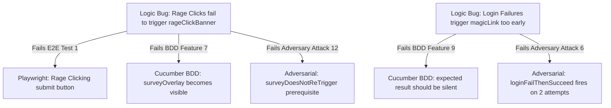

# Comparative Testing Report: Playwright E2E vs. Cucumber BDD vs. Adversarial Audit

This report evaluates and compares the three distinct testing methodologies implemented in the frustration-detection login project. It covers their scope, target audience, execution characteristics, and diagnostic capability, backed by current test run metrics.

---

## Executive Summary

The project utilizes three complementary layers of testing to validate a frontend client-side user frustration model (detecting rage clicks, mouse jitter, backtracking, and authentication failures):

1. **Playwright E2E (Functional Validation)**: Verifies that standard end-to-end user journeys and page transitions display the correct UI elements under basic interaction assumptions.
2. **Cucumber BDD (Behavioral Specification)**: Translates user stories and business logic into structured executable tests that serve as living documentation for developers, QAs, and stakeholders.
3. **Adversarial Audit (Edge-Case & Boundary Validation)**: Stresses the mathematical boundary logic, window resets, and false-positive suppression rules under programmatic micro-interactions.

---

## High-Level Comparison Matrix

| Feature / Dimension | Playwright E2E | Cucumber BDD | Adversarial Audit |
| :--- | :--- | :--- | :--- |
| **Primary Focus** | User journeys & functional regression | Business specifications & living documentation | Algorithm boundary conditions & state validation |
| **Target Audience** | Frontend Developers, QA Engineers | Product Owners, QA, Stakeholders, Devs | Security & Algorithm Engineers, Core Devs |
| **Test Syntax** | JavaScript (`playwright/test` specs) | Gherkin (`.feature` files) + JS step bindings | Node.js scripting with Puppeteer/Playwright sandboxes |
| **Execution Command** | `npm test` | `npm run test:bdd` | `npm run adversary` |
| **Simulated Interactions** | High-level (clicks, input fills, moves) | Human-centric behavior flow | Fine-grained micro-interactions (e.g. precise timings, jitters) |
| **Execution Time** | ~31 seconds | ~89 seconds | ~55 seconds |
| **Current Pass Rate** | **78.6%** (11 / 14 passed) | **75.7%** (28 / 37 passed) | **83.3%** (10 / 12 passed) |

---

## Deep Dive into the Three Testing Manners

### 1. Playwright End-to-End (E2E) Suite
* **Directory**: [tests/](file:///c:/Users/rami/Desktop/int102/tests)
* **Goal**: Validate that basic visual elements appear or disappear correctly under simulated interactions.
* **Characteristics**:
  * Runs multi-browser targets in parallel (Chromium and Firefox).
  * Direct assertions on the DOM (e.g., `.toBeVisible()`, `.toContainText()`).
  * **Strengths**: Reliable checks for UI regressions, screen layout changes, and visual modals.
  * **Weaknesses**: Hardcoded user interactions do not test variations in timing or complex boundary limits.

### 2. Cucumber BDD (Behavior-Driven Development) Suite
* **Directory**: [features/](file:///c:/Users/rami/Desktop/int102/features)
* **Goal**: Define human-readable specifications of system behaviors to align development with business expectations.
* **Characteristics**:
  * Written in natural language Gherkin syntax (`Given/When/Then`).
  * Promotes collaboration across roles (Product, QA, Development).
  * **Strengths**: Serves as a readable specification of feature files.
  * **Weaknesses**: Slower execution speed (requires parsing Gherkin steps) and overhead in managing step definition mappings.

### 3. Adversarial Audit Suite
* **Directory**: [scripts/adversary/](file:///c:/Users/rami/Desktop/int102/scripts/adversary)
* **Goal**: Systematically verify the sensitivity limits, timeout expirations, recovery behaviors, and negative-suppression capabilities of the detection heuristics.
* **Characteristics**:
  * Runs 12 specialized attacks testing **Positive**, **Negative**, **Boundary**, **Reset**, and **Recovery** categories.
  * Generates a detailed JSON log mapping out granular outcomes.
  * **Strengths**: Isolates logic bugs (e.g., checks if a 4-click action remains silent when the threshold is 5).
  * **Weaknesses**: High maintenance when thresholds are adjusted; decoupled from standard business user journeys.

---

## Analysis of Correlated Failure Patterns

Analyzing the failures across all three suites reveals how a single logic issue propagates across different testing layers:

### Key Diagnostic Takeaways
1. **Rage Click Trigger Failure**:
   * *Playwright E2E* fails to see `#rageClickBanner`.
   * *Cucumber BDD* fails to trigger the `#surveyOverlay` (which depends on rage click detection).
   * *Adversary* fails `12. surveyDoesNotReTrigger` because the prerequisite first-time rage click fails to launch the survey.
   * **Diagnosis**: The core click detection logic on the submit button is failing to register rapid clicks under browser automation dispatch events.

2. **Login Failure Threshold Mismatch**:
   * *Cucumber BDD* asserts that intermediate states should stay `"silent"` or `"suppressed"`, but fails.
   * *Adversary* fails `6. loginFailThenSucceed` because the Magic Link banner triggers at **2 failures** instead of the specified **3**.
   * **Diagnosis**: A threshold bounds check issue (likely an off-by-one index error in the logic `attempts >= threshold` vs `attempts > threshold`).

3. **Session Recorder API Event Count**:
   * *Cucumber BDD* fails on `#recEventCount` expecting it not to be `"0"`.
   * **Diagnosis**: Event listeners on the session recorder are not intercepting/recording client interactions correctly.

---

## Recommendations & Next Steps

* **Refine Click Emulation**: Investigate if the application relies on native click bubbles rather than dispatch events, since E2E and BDD handle events differently.
* **Fix the Off-by-One Thresholds**: Sync the configuration between the application script and the test suites.
* **Improve Test Run Speeds**: Enable step-level caching in Cucumber or run BDD scenarios in parallel where independent.
